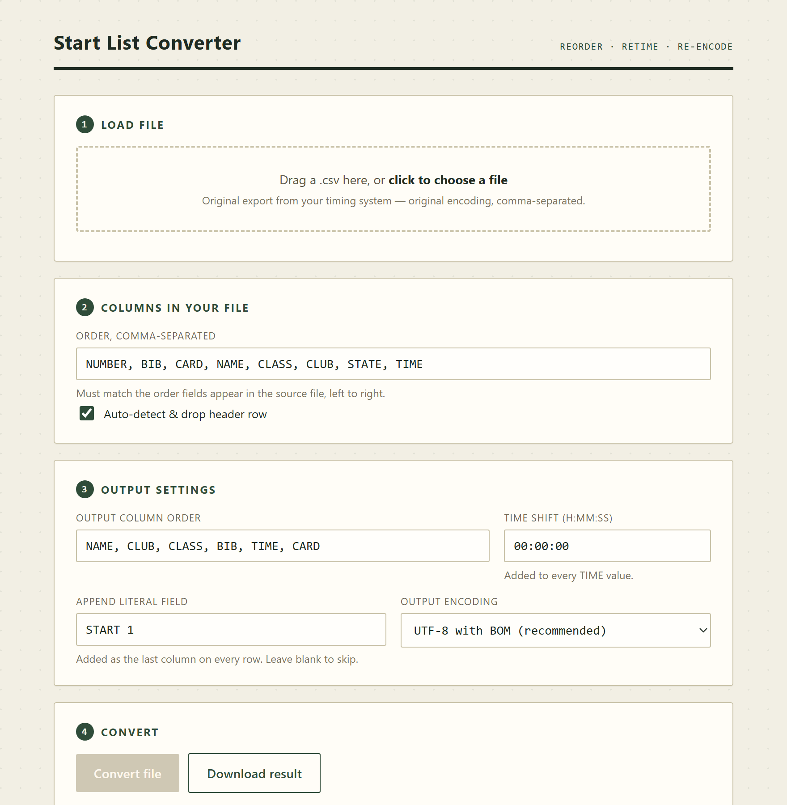
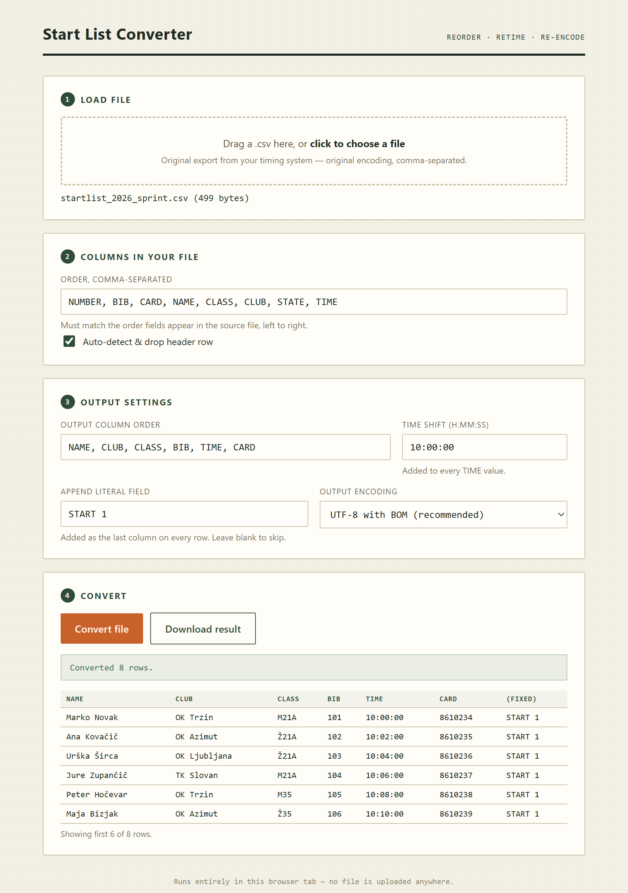
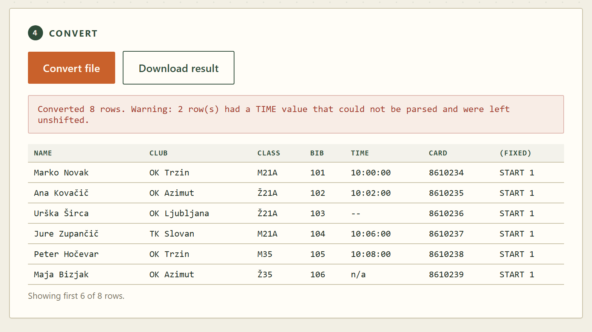

# Start List Converter (CSV editor for OChecklist)

A single-page browser tool that reshapes a start list exported from an orienteering timing system into the CSV layout [OChecklist](https://play.google.com/store/apps/details?id=se.tg3.startlist) expects: columns reordered, start times shifted to real clock time, an extra literal field appended, and the text re-encoded.

The whole thing is one self-contained HTML file. There is no build step, no install, no server, and no upload — the file you drop in never leaves your browser tab.



## Quick start

1. Download [`CSV-OChecklist.html`](CSV-OChecklist.html).
2. Open it in any modern browser (double-click works; `file://` is fine).
3. Drop your start list CSV on the box, adjust the settings, press **Convert file**, then **Download result**.

The result is saved as `<original-name>_converted.csv`.

## What it does

Given an export like this — the order competitors were drawn, with start times as offsets from zero:

```csv
NUMBER,BIB,CARD,NAME,CLASS,CLUB,STATE,TIME
1.,101,8610234,Marko Novak,M21A,OK Trzin,SLO,00:00:00
2.,102,8610235,Ana Kovačič,Ž21A,OK Azimut,SLO,00:02:00
3.,103,8610236,Urška Širca,Ž21A,OK Ljubljana,SLO,00:04:00
```

…with a time shift of `10:00:00`, it produces:

```csv
Marko Novak,OK Trzin,M21A,101,10:00:00,8610234,START 1
Ana Kovačič,OK Azimut,Ž21A,102,10:02:00,8610235,START 1
Urška Širca,OK Ljubljana,Ž21A,103,10:04:00,8610236,START 1
```

Four things changed: the columns were reordered, `NUMBER` and `STATE` were dropped, every `TIME` was shifted by ten hours, and `START 1` was appended to each row.



## Usage

### 1 — Load file

Drag a `.csv` onto the drop zone, or click it to open a file picker. The filename and size appear underneath once it is read. Loading a new file clears any previous result.

### 2 — Columns in your file

**Order, comma-separated** describes your *source* file: the field names in the order they appear, left to right. The names are labels for the converter's own use, so what matters is that the count and order line up with the real columns. Only these names carry meaning:

| Name | Meaning |
| --- | --- |
| `TIME` | The only field that gets shifted. |
| any other | Passed through unchanged; usable in the output order. |

Names are case-insensitive (they are upper-cased internally). A column you never reference in the output can be called anything — `SKIP`, `X`, whatever — as long as it occupies the right position.

**Auto-detect & drop header row** discards the first row when its first field is not a plain number. `1` and `1.` are read as data; `NUMBER` or `No.` are read as a header. Untick it if your file has no header and the first competitor's leading field is non-numeric.

### 3 — Output settings

**Output column order** lists the fields to write, in order. Names not present in the input list produce empty fields rather than an error, which is a quick way to insert a blank column.

**Time shift (H:MM:SS)** is added to every `TIME` value. This is how a draw that starts at `00:00:00` becomes a real start time. Note how the value is parsed:

| Entered | Read as |
| --- | --- |
| `10:00:00` | 10 h |
| `1:30` | 1 h 30 min |
| `90` | **90 hours**, not 90 minutes |

A bare number means hours, so use the full `H:MM:SS` form to avoid surprises.

**Append literal field** adds the same fixed text as the last column of every row — `START 1` by default, identifying the start for OChecklist. Leave it empty to append nothing.

**Output encoding** — see [Encoding](#encoding) below.

### 4 — Convert

**Convert file** runs the conversion and shows a green status line plus a preview of the first six output rows. **Download result** saves the file. Both the preview and the download reflect the settings as they were when you pressed Convert, so re-press it after any change.

## Reference

### Time handling

`TIME` values are parsed, shifted, and rewritten as zero-padded `HH:MM:SS`:

- `HH:MM:SS` → parsed as hours, minutes, seconds.
- `MM:SS` → parsed as **minutes and seconds**, so `12:30` is 12 min 30 s, not half past twelve.
- Empty values are left empty and never shifted.
- Anything else (`--`, `n/a`, `DNS`) is left exactly as-is and counted in a warning.

Rows with an unreadable `TIME` are still converted — only that one field goes through unshifted. The status line turns red and tells you how many rows were affected, so you can go back and fix the source:



### Encoding

Input is decoded as **Windows-1250**, the encoding these exports typically use. That is what makes `č`, `š` and `ž` survive the round trip.

Output offers three choices, but only two distinct results:

| Option | What is actually written |
| --- | --- |
| UTF-8 with BOM | UTF-8, byte-order mark first. The safe default for Excel. |
| UTF-8, no BOM | Plain UTF-8. |
| Windows-1250 | **UTF-8 with BOM.** Browsers cannot encode legacy code pages, so this silently falls back and says so in the status line. |

Rows are terminated with CRLF and no header row is written.

### Privacy

Everything runs in the page. The file is read with `FileReader` and the result is built as an in-memory `Blob`; there is no network code in the file at all.

## Limitations

Worth knowing before a race day:

- **Input is always read as Windows-1250.** A source file that is genuinely UTF-8 will have its accented characters mangled. Convert it to Windows-1250 first, or stick to plain ASCII.
- **Windows-1250 output does not work** — it writes UTF-8 with BOM instead. If OChecklist needs true CP1250, re-encode the downloaded file with another tool.
- **Output fields are not quoted.** The input parser understands `"quoted, fields"`, but the writer just joins values with commas. A club or name containing a comma will split into two columns in the output.
- **Comma is the only input delimiter.** Semicolon- or tab-separated exports are not recognised; the whole line lands in the first field.
- **Column names must be unique.** Two identically named input columns collide, and the later one wins.
- The source column list is positional — it must match the real file exactly, or fields are silently read from the wrong places.

## Browser support

Any current version of Chrome, Edge, Firefox or Safari. The page relies on `TextDecoder`, `TextEncoder`, `Blob` and `FileReader`, all long-standing standard APIs. No internet connection is needed once the file is on disk.

## Repository layout

```
CSV-OChecklist.html    the entire application
screenshots/           images used by this README
```
